# 🔀 DOSPRESSO — Modül Akış Haritası

> **Bu doküman ne için?** 11 ana modülün **end-to-end iş akışlarını** Mermaid sequence diyagramlarıyla gösterir. Bir senaryo (örn. müşteri şikâyeti) baştan sona hangi rollerden geçer, hangi onayları alır, hangi tabloya yazılır — tek bakışta görünür.
>
> **Kullanım:** Master harita (`docs/SISTEM-VE-ROLLER-MASTER.md`) modülleri tanıttı. Bu doküman modüller arasındaki iş akışlarını derinleştirir.

---

## İçerik

1. [Görev (m05) — Tipik Görev Yaşam Döngüsü](#1-görev-m05--tipik-görev-yaşam-döngüsü)
2. [İK (m02) — İzin Talebi → Çift Onay](#2-i̇k-m02--i̇zin-talebi--çift-onay)
3. [Akademi (m07) — Stajyer Onboarding 14 Günü](#3-akademi-m07--stajyer-onboarding-14-günü)
4. [Fabrika (m09) — Reçete → Plan → Üretim → Sevkiyat](#4-fabrika-m09--reçete--plan--üretim--sevkiyat)
5. [CRM (m08) — Müşteri Şikâyeti → Atama → Çözüm](#5-crm-m08--müşteri-şikâyeti--atama--çözüm)
6. [Kalite (m05/m20) — Denetim → Düzeltici Faaliyet](#6-kalite-m05m20--denetim--düzeltici-faaliyet)
7. [Ekipman (m06) — Arıza Bildirimi → Servis](#7-ekipman-m06--arıza-bildirimi--servis)
8. [Satınalma (m10) — PO → Mal Kabul → Ödeme](#8-satınalma-m10--po--mal-kabul--ödeme)
9. [Vardiya (m03) — Kiosk PIN Login → Check-in/out](#9-vardiya-m03--kiosk-pin-login--check-inout)
10. [Mr. Dobody (m12) — AI Öneri Zinciri](#10-mr-dobody-m12--ai-öneri-zinciri)
11. [Bildirim (m05) — 4-Katmanlı Bildirim Akışı](#11-bildirim-m05--4-katmanlı-bildirim-akışı)
12. [Pilot Launch — GO/NO-GO Akışı](#12-pilot-launch--gono-go-akışı)

---

## 1. Görev (m05) — Tipik Görev Yaşam Döngüsü

**Senaryo:** Saha Koçu (coach) bir şube müdürüne (mudur) "Bu hafta vitrin temizliği fotoğraflı" görevini atar. Müdür kabul eder, baristaya devreder, barista kanıt yükler, koç onaylar.

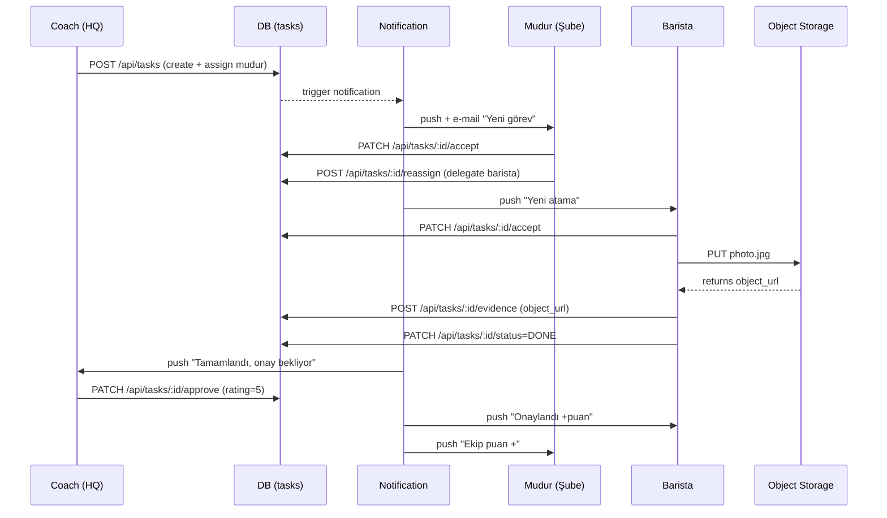

**Status zinciri:** `OPEN → ACCEPTED → IN_PROGRESS → DONE → APPROVED` (alternatif: `REJECTED`, `REASSIGNED`)
**Tablolar:** `tasks`, `task_assignees`, `task_comments`, `task_evidence`, `notifications`
**Kanıt depolama:** Replit Object Storage (`PRIVATE_OBJECT_DIR` altında)
**Rate sınırı:** Bir kullanıcıya günlük max 20 görev (anti-spam)

---

## 2. İK (m02) — İzin Talebi → Çift Onay

**Senaryo:** Barista 3 günlük yıllık izin talep eder. Şube müdürü ön-onay verir, İK (muhasebe_ik) final onay verir, bordroya yansır.

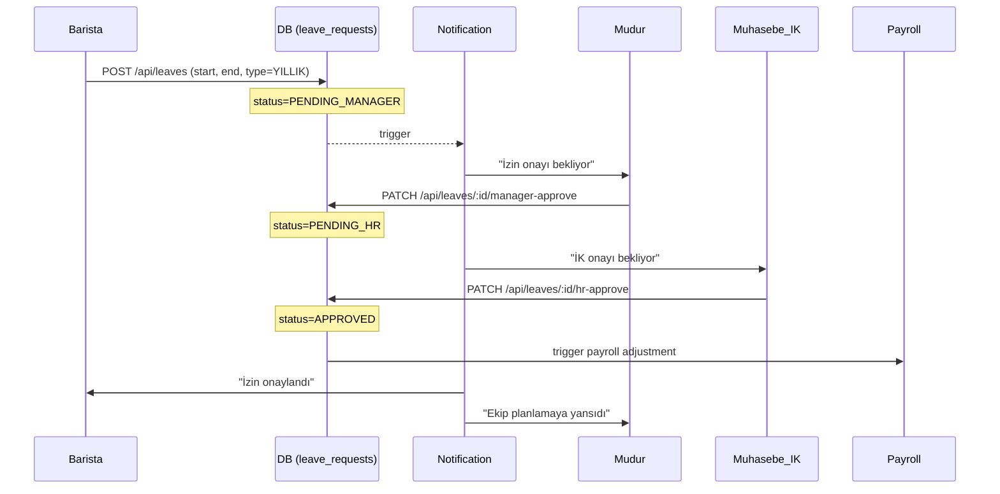

**Onay matrisi:** Bkz. `docs/role-flows/00-cross-role-matrix.md` §3 Boyut 2 — Onay Matrisi.
**Reddetme:** Herhangi bir aşamada `PATCH /reject` ile gerekçe yazılır, talep `REJECTED` olur.
**Veri kilidi:** Onaylandıktan sonra leave_requests kaydı **kilitlenir** (data lock). Değişiklik için change request açılır.

---

## 3. Akademi (m07) — Stajyer Onboarding 14 Günü

**Senaryo:** Yeni işe alınan bir stajyer 14 günlük programa giriyor. Sonunda Gate-0 sınavı geçerse Bar Buddy oluyor.

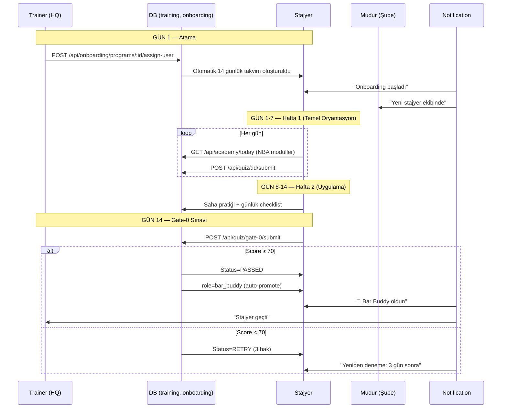

**Eğitim yolu:** `stajyer → bar_buddy → barista → supervisor_buddy → supervisor`
**NBA (Next Best Action) motoru:** `docs/01-user-flows.md` §5 detayları içerir
**Sertifika:** Her gate sonrası `issued_certificates` tablosuna kayıt + PDF üretimi

---

## 4. Fabrika (m09) — Reçete → Plan → Üretim → Sevkiyat

**Senaryo:** Yeni bir reçete (recete_gm onayıyla) sisteme girer, fabrika müdürü haftalık plana ekler, üretim şefi günlük dağıtır, operatör batch üretir, depo şubeye sevk eder.

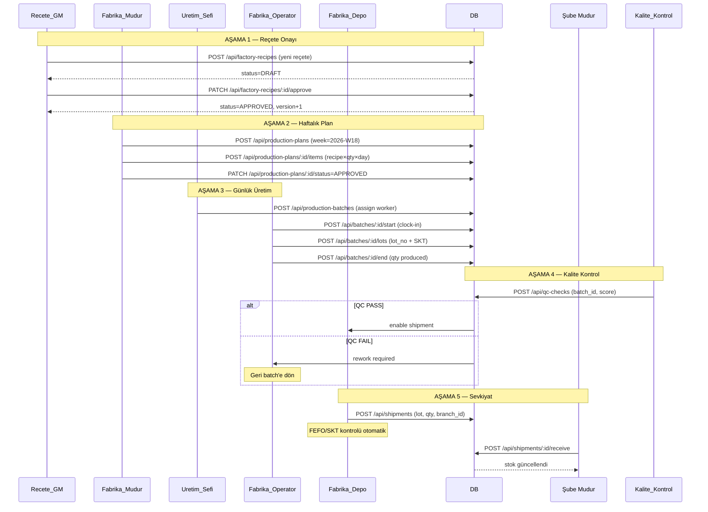

**Tablolar:** `factory_recipes`, `weekly_production_plans`, `production_plan_items`, `production_batches`, `lots`, `qc_checks`, `shipments`
**FEFO (First-Expired-First-Out):** Depo otomatik en yakın SKT'yi seçer
**SPOF:** `recete_gm` rolü tek kullanıcı — hastalık/izin riski (FINDINGS #2)

---

## 5. CRM (m08) — Müşteri Şikâyeti → Atama → Çözüm

**Senaryo:** Müşteri QR feedback ile "Kahvem soğuktu" şikâyeti yazar. Otomatik kategoriye düşer, destek atar, müdür çözer, müşteriye geri bildirim gönderilir.

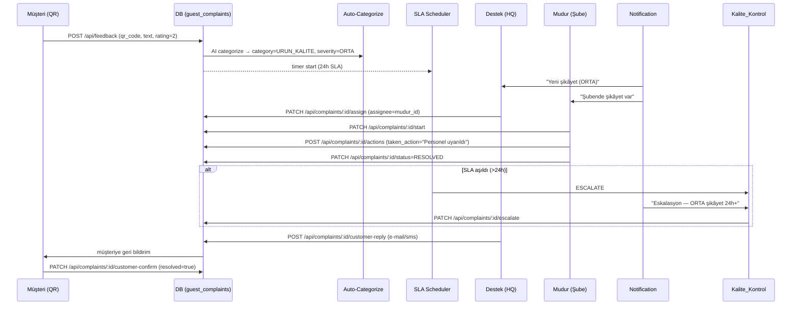

**Severity skalası:** DUSUK (72h SLA), ORTA (24h), YUKSEK (4h), KRITIK (1h)
**Kategori örnekleri:** URUN_KALITE, HIZ, NEZAKET, FIYAT, TEMIZLIK
**Eskalasyon zinciri:** destek → mudur → kalite_kontrol → cgo

---

## 6. Kalite (m05/m20) — Denetim → Düzeltici Faaliyet

**Senaryo:** Saha koçu (coach) bir şubeye habersiz denetime gider, audit_v2 şablonunu kullanır, eksiklik bulur, düzeltici faaliyet açılır, müdür düzeltir, re-denetim yapılır.

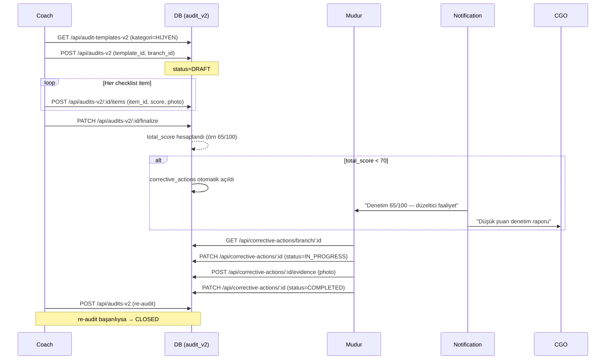

**Tablolar:** `audit_templates_v2`, `audits_v2`, `audit_v2_items`, `corrective_actions`, `corrective_action_evidence`
**Eşik:** <70 düşük, 70-85 orta, >85 yüksek skor
**Re-denetim:** Düzeltici faaliyet kapandıktan max 14 gün sonra zorunlu

---

## 7. Ekipman (m06) — Arıza Bildirimi → Servis

**Senaryo:** Barista espresso makinesinde arıza fark eder, fotoğrafla bildirir. Teknik ekibe atanır, parça gelir, servis yapılır, kapatılır.

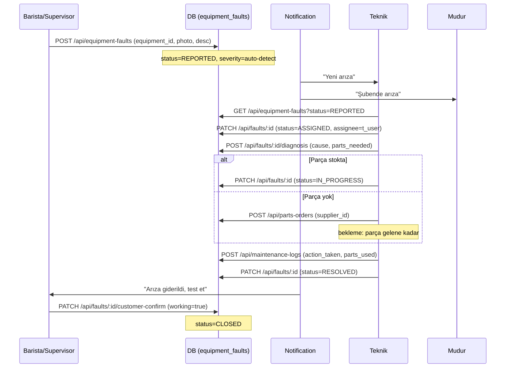

**Tablolar:** `equipment`, `equipment_faults`, `maintenance_logs`, `parts_orders`
**Periyodik bakım:** Scheduler her ay otomatik task açar (m12 dobody üzerinden)

---

## 8. Satınalma (m10) — PO → Mal Kabul → Ödeme

**Senaryo:** Şube müdürü kahve çekirdeği ister, satınalma tedarikçi seçer, PO açar, fabrika depo mal kabul yapar, muhasebe öder.

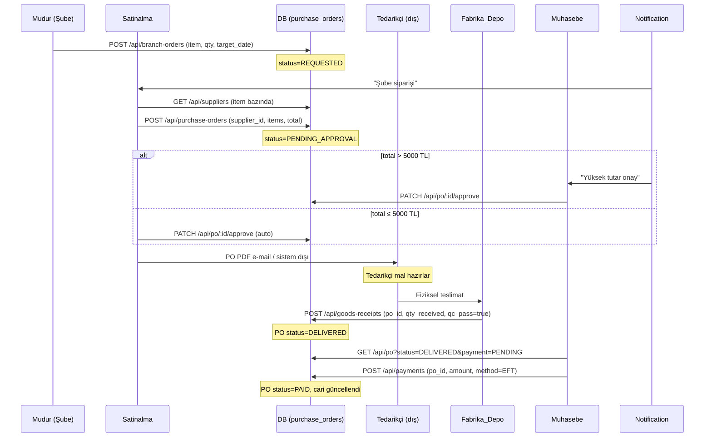

**Tablolar:** `purchase_orders`, `purchase_order_items`, `suppliers`, `goods_receipts`, `payments`, `branch_financial_summary`
**Onay eşikleri:** ≤5000 TL satinalma yetkili, >5000 TL muhasebe onayı, >50000 TL ceo onayı
**Cari takip:** Her ödeme `branch_financial_summary` ve tedarikçi cari hesabını günceller

---

## 9. Vardiya (m03) — Kiosk PIN Login → Check-in/out

**Senaryo:** Barista sabah şubeye gelir, kiosk cihazından 4-haneli PIN girer, vardiyasına check-in yapar, mola verir, check-out yapar.

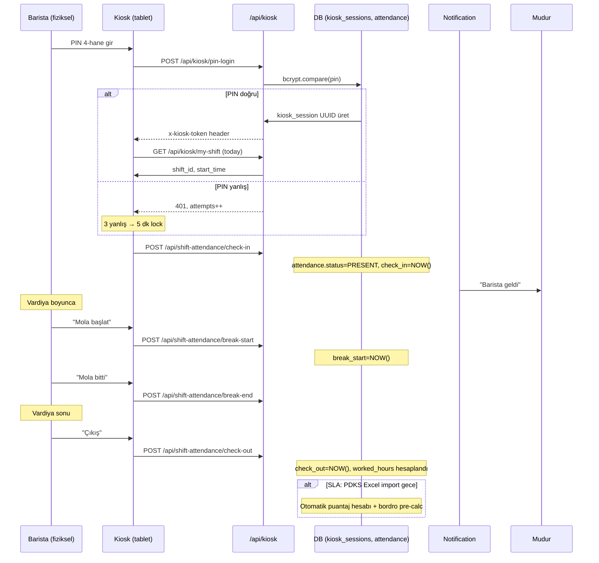

**Tablolar:** `shifts`, `shift_attendance`, `kiosk_sessions`
**Kiosk token TTL:** Vardiya sonuna kadar (max 12h)
**PIN brute force koruması:** 3 yanlış → 5 dk lock + audit log
**Mobile QR alternatifi:** `mobile_qr` flag açıksa kuryeler/saha için QR kod tarama (TASK-004 audit edilecek)

---

## 10. Mr. Dobody (m12) — AI Öneri Zinciri

**Senaryo:** Agent gece KPI analizi yapar, "Lara şubesi son 7 gün cila puanı düşüyor" tespit eder, öneri kartı oluşturur, koç onaylar, otomatik task açılır.

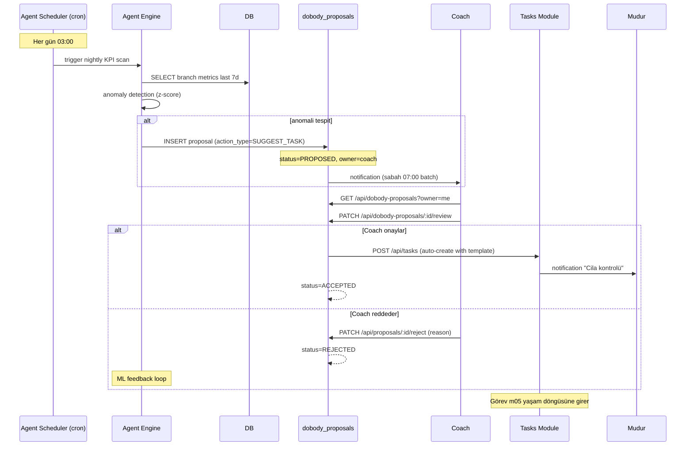

**Aksiyon türleri:** Remind, Escalate, Report, Suggest Task
**ML feedback:** Reddedilen öneriler agent'ın ileride benzer önerileri filtrelemesini sağlar
**Detay:** `docs/DOBODY-AGENT-PLAN.md`, `docs/dobody-security-spec.md`

---

## 11. Bildirim (m05) — 4-Katmanlı Bildirim Akışı

**Senaryo:** Bir günde aynı kullanıcıya farklı katmanlardan bildirim düşer. Sistem önceliklendirme + frekans kontrolü yapar.

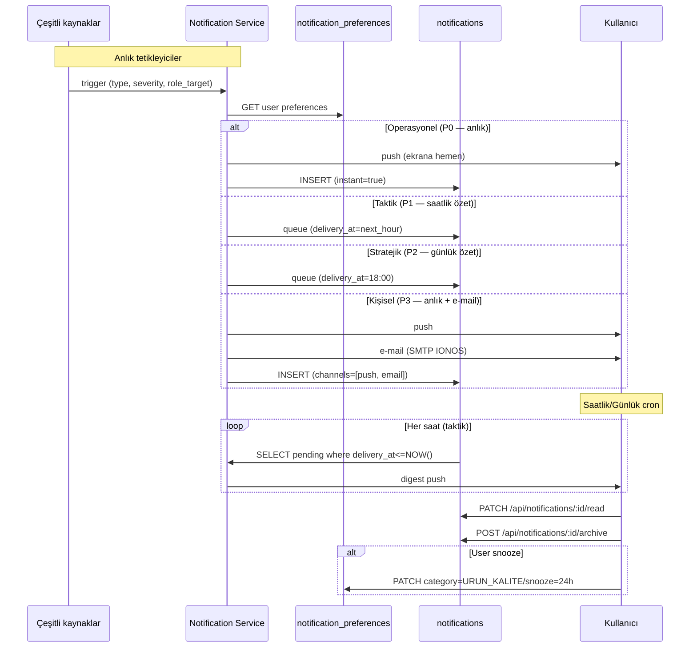

**Katman sembolleri:** P0 (kırmızı), P1 (turuncu), P2 (mavi), P3 (yeşil)
**Push:** Web Push API (PWA), email: IONOS SMTP
**Audit:** `bildirim-sistemi-v2-audit-raporu.md`

---

## 12. Pilot Launch — GO/NO-GO Akışı

**Senaryo:** 28 Nis 2026 Salı 09:00 pilot başlar. İlk gün sonunda 4 sayısal eşik ölçülür, 4/3 kuralıyla ertesi gün GO veya NO-GO kararı verilir.

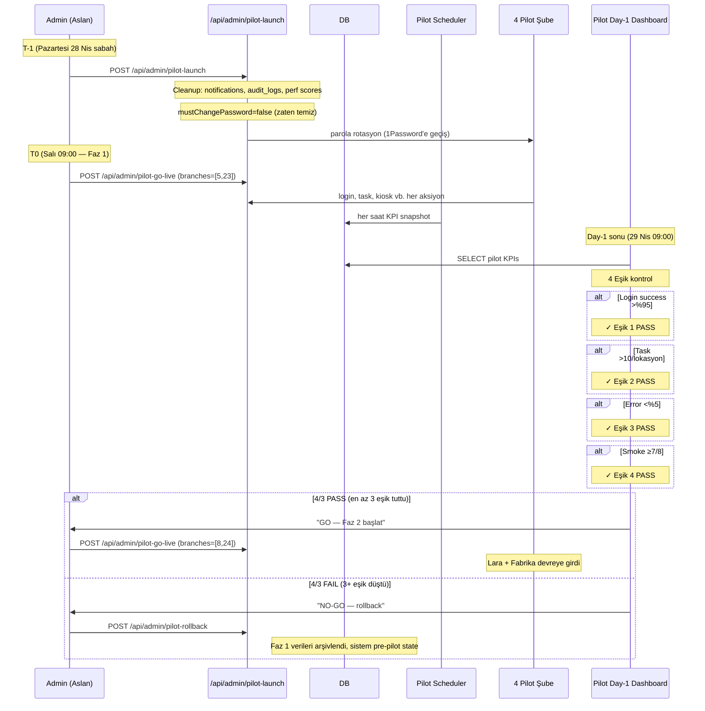

**Kaynaklar:**
- `docs/pilot/success-criteria.md` — eşik tanımları
- `docs/pilot/day-1-report.md` — rapor template
- `scripts/pilot/00-db-isolation.sql` — Pazar 22:30 mantıksal izolasyon
- `scripts/pilot/yuk-testi-5-user.ts` — gerçek 5-user yük testi (adminhq 4-step ✅ avg 178ms, max 463ms)

---

## 📌 Özet Tablo: Akış × Modül × Roller

| Akış | Ana Modül | Tetikleyen Rol | Onaylayan Rol(ler) | Sonlanış |
|------|-----------|----------------|---------------------|----------|
| Görev yaşam döngüsü | m05 | herhangi | atayan rol | APPROVED/REJECTED |
| İzin talebi | m02 | personel | mudur + muhasebe_ik | APPROVED → bordro |
| Stajyer onboarding | m07 | trainer | trainer (gate-0) | role auto-promote |
| Üretim sevkiyat | m09 | recete_gm + fabrika_mudur | kalite_kontrol QC | shipment.received |
| Müşteri şikâyet | m08 | müşteri (QR) | mudur + destek | RESOLVED + reply |
| Denetim | m05/m20 | coach | coach (re-audit) | CLOSED |
| Arıza | m06 | personel | teknik | CLOSED |
| Satınalma | m10 | mudur | satinalma + muhasebe | PAID |
| Vardiya check-in | m03 | personel (kiosk) | mudur (puantaj) | worked_hours |
| AI öneri | m12 | system (cron) | öneri sahibi | task auto-create |
| Bildirim | m05 | her event | n/a | read/archive |
| Pilot launch | system | admin | 4-eşik 4/3 kuralı | GO/NO-GO |

---

**Bağlantılı dokümanlar:**
- Master harita: [`docs/SISTEM-VE-ROLLER-MASTER.md`](./SISTEM-VE-ROLLER-MASTER.md)
- 31 rol detay: [`docs/role-flows/`](./role-flows/)
- Cross-role 4-boyutlu matris: [`docs/role-flows/00-cross-role-matrix.md`](./role-flows/00-cross-role-matrix.md)
- Onay diyagramları (8 senaryo): [`docs/role-flows/00-cross-role-matrix.md`](./role-flows/00-cross-role-matrix.md) §6

---

**Son güncelleme:** 20 Nis 2026 Pazartesi · **Sürüm:** v1.0 · **Sahibi:** Replit Agent
