# 🗺️ DOSPRESSO — Sistem ve Roller Master Haritası

> **Bu doküman ne için?** DOSPRESSO franchise yönetim platformunu **30 dakika** içinde tamamen anlamak için tek-nokta-giriş haritasıdır. Yeni bir geliştirici, danışman, ortak veya denetçi sistemi buradan başlayarak tüm modülleri, 31 rolü ve aralarındaki iş akışlarını izleyebilir. Her başlık altında daha derin detay dokümanlarına link bulacaksınız.
>
> **Üretim tarihi:** 20 Nisan 2026 Pazartesi
> **Sürüm:** v1.0 — pilot öncesi (28 Nis 2026)
> **Sahibi:** Replit Agent + Claude (üçgen koordinasyon, bkz. `docs/AGENT-OWNERSHIP.md`)

---

## 📖 30 Dakikalık Okuma Kılavuzu

| Süre | Bölüm | Çıktı |
|------|-------|-------|
| 0–5 dk | §1 Sistem Kimliği + §2 Tech Stack | Topoloji ve mimariyi anla |
| 5–15 dk | §3 12 Modül Özet Kartı | Sistem ne iş yapar öğren |
| 15–25 dk | §4 31 Rol + §5 Yetki Matrisi | Kim ne yapar gör |
| 25–30 dk | §6 Kritik İş Akışları | En önemli 3 senaryoyu izle |
| Daha derin | §7-12 ve linkli detay dokümanlar | İhtiyaç duyduğunda dön |

---

## 1. Sistem Kimliği

DOSPRESSO; bir kahve/yiyecek franchise zincirinin **22 fiziksel lokasyon × 372 aktif kullanıcı × 31 farklı rol × 12 ana modül** ölçeğinde tüm operasyonel süreçlerini tek platformda yöneten dahili bir yazılım sistemidir.

| Boyut | Sayı | Detay |
|-------|------|-------|
| Lokasyon | **22** | 20 şube + 1 HQ (merkez) + 1 Fabrika |
| Aktif kullanıcı | **372** | Pilot başlangıcında |
| Rol sayısı | **31** | 4 kategoride (Admin, HQ, Branch, Factory) |
| Ana modül | **12** | `m01-core` … `m12-dobody` |
| Şubedeki rol sayısı | **8** | mudur, supervisor, supervisor_buddy, barista, bar_buddy, stajyer, yatirimci_branch, sube_kiosk |
| HQ rol sayısı | **16** | admin, ceo, cgo + 13 departman/legacy |
| Fabrika rol sayısı | **9** | fabrika_mudur, uretim_sefi, fabrika_operator, fabrika_sorumlu, fabrika_personel, fabrika_depo, sef, recete_gm, fabrika |
| Pilot tarihi | **28 Nis 2026** Salı 09:00 | Faz 1: Işıklar (5) + HQ (23) → 24h → Faz 2: Lara (8) + Fabrika (24) |

**Kaynak doğrulaması:** Rol enum kaynak dosya `shared/schema/schema-01.ts:52-92`. Lokasyon bilgisi `replit.md` ve pilot dokümanları (`docs/pilot/`).

---

## 2. Tech Stack & Mimari

### 2.1 Teknoloji Yığını

| Katman | Teknoloji | Notlar |
|--------|-----------|--------|
| Frontend | React 18 + TypeScript + Vite | SPA, route lib: **wouter** |
| UI | Shadcn/ui + Tailwind + Radix + Lucide icons | CVA varyant sistemi |
| State/Data | TanStack Query v5 | `queryKey: ['/api/endpoint']` standardı |
| Backend | Node.js + Express + TypeScript | 116 route dosyası `server/routes/` |
| ORM | Drizzle ORM | Schema 23 dosyaya bölünmüş `shared/schema/` |
| DB | PostgreSQL (Neon serverless) | Connection pool, sessions DB-backed |
| Auth | Passport.js (LocalStrategy) + express-session (connect-pg-simple) | Web (username/parola) + Kiosk (PIN/QR) |
| Storage | Replit Object Storage (Google Cloud Storage tabanlı) | Multer ile upload |
| AI | OpenAI API | Vision, chat, embeddings, summarization |
| E-posta | IONOS SMTP | Bildirimler + onboarding |
| Mobil/PWA | Tarayıcı tabanlı | Native değil — kiosk + mobile-first sayfalar |

### 2.2 Server Boot Süreci (`server/index.ts`)

Sunucu başladığında 5 adımlı sıralı başlatma:

1. **DB Diagnostics & Bootstrap:** Bağlantı kontrolü → admin user yoksa `bootstrapAdminUser()` ile ilk admin kullanıcı oluştur (parola env'den).
2. **Schema Migrations:** Eksik kolonları (`setup_complete`, `onboarding_complete`) idempotent olarak ekle (`db.execute` ile raw SQL kontrol).
3. **Seeding (paralel):** Roller + izinler + menüler + tarif şablonları + PDKS yapılandırması.
4. **Security Patches:** Pilot öncesi `mustChangePassword=true` flaglerini temizle (zorunlu parola değiştirme dialogu pre-pilot fazında devre dışı).
5. **Schedulers (lazy init, +30sn):** SLA check, reminder, agent scheduler, PDKS scheduler, backup scheduler tek `schedulerManager` altında başlatılır.

Tüm akışın tek dosyası: `server/index.ts`.

### 2.3 Auth: Web vs Kiosk

İki ayrı kanal, aynı `users` tablosu üstünde:

| Özellik | Web Auth | Kiosk Auth |
|---------|----------|------------|
| Kullanıcı adı | username + bcrypt parola | username + 4-haneli PIN (bcrypt) veya QR token |
| Session | `sessions` tablosu (express-session, 8 saat TTL) | `kiosk_sessions` tablosu (UUID token, vardiya bazlı) |
| Eşzamanlı limit | Aynı user için max **2 aktif session** (3.'sü en eskiyi siler → `auth.session_forced_logout`) | Şube başına 1 cihaz |
| Hedef rol | Tüm rolleri | Şube içi (sube_kiosk + personel hızlı giriş) |
| Header/Cookie | Cookie-based session | `x-kiosk-token` header |

Detay: `docs/auth-audit-report.md`.

### 2.4 Veri Pattern'leri

- **Soft Delete:** Tüm iş tablolarında `deleted_at TIMESTAMP NULL` kolonu. Drizzle query'leri `WHERE deleted_at IS NULL` ile filtreler. Fiziksel DELETE yok.
- **Data Lock:** Geçmiş veri (örn. finansal kayıtlar) `data-lock.ts` ile `lockAfterDays` veya `lockOnStatus` kuralıyla kilitlenir. Değişiklik için `data_change_log` + `record_revisions` tabloları üzerinden change-request workflow.
- **Audit Trail:** Kritik aksiyonlar `audit_logs` tablosuna yazılır.
- **HTTP 423 Locked:** Kilitli kayda yazma denemeleri 423 döner; UI buna göre "kilitli" rozeti gösterir.

---

## 3. 12 Ana Modül — Özet Kartları

Sistemin tüm fonksiyonelliği 12 modül + 80+ alt-modül altında toplanmıştır. Aşağıdaki kartlar her modülün ana sayfa, route, schema, entity ve hangi rollerin neye eriştiğini özetler. Detaylı cross-module akış diyagramları için **`docs/MODUL-AKIS-HARITASI.md`**.

### 🔧 m01-core — Sistem Çekirdeği
- **Ne yapar:** Auth, kullanıcılar, roller, şubeler, modül-flag yönetimi, audit log, ayarlar.
- **Ana sayfa:** `/admin/*` (admin paneli)
- **Route:** `server/routes/auth.ts`, `users.ts`, `branches.ts`, `module-flags.ts`, `admin-routes.ts`
- **Schema:** `shared/schema/schema-01.ts` (users, roles, branches, sessions, module_flags)
- **Erişen rol:** **admin** (CRUD), **ceo/cgo** (read-only), diğerleri (kendi profili)

### 👥 m02-ik — İnsan Kaynakları
- **Ne yapar:** Personel kayıtları, özlük dosyaları, onboarding, disiplin, sertifika, izin, oryantasyon.
- **Ana sayfa:** `/ik`, `/personel-centrum`, `/personel-profil/:id`
- **Route:** `server/routes/hr.ts`, `hr-management-routes.ts`, `onboarding-v2-routes.ts`
- **Schema:** `schema-01.ts` (users), `schema-09.ts` (onboarding), `schema-11.ts` (employee details)
- **Entity:** `users`, `employee_documents`, `employee_onboarding`, `disciplinary_reports`
- **Erişen rol:** **muhasebe_ik** (CRUD HQ), **mudur** (CRUD kendi şubesi), **supervisor** (read), **personel** (kendi profili)
- **Detay doc:** `docs/CALISMA-SISTEMI.md`

### ⏰ m03-vardiya — Vardiya & PDKS
- **Ne yapar:** Vardiya planlama, kiosk check-in/out, mola takibi, PDKS Excel import (5 tablo), izin talepleri, puantaj.
- **Ana sayfa:** `/vardiyalar`, `/pdks`, `/pdks-excel-import`, `/leave-requests`
- **Route:** `server/routes/shifts.ts`, `pdks.ts`, `pdks-excel-import.ts`
- **Schema:** `schema-06.ts` (shifts, attendance, leaves), 5 PDKS Excel tablosu
- **Entity:** `shifts`, `shift_attendance`, `leave_requests`, `pdks_excel_imports/_records/_daily_summary/_monthly_stats/_employee_mappings`
- **Erişen rol:** **mudur/supervisor** (plan + onay), **personel** (kendi vardiya + check-in), **muhasebe_ik** (puantaj)

### 💰 m04-bordro — Bordro & Finans
- **Ne yapar:** Maaş hesaplama, prim, kesinti, bordro PDF, vergi.
- **Ana sayfa:** `/maas-hesaplama`, `/mali-yonetim`
- **Route:** `server/routes/payroll.ts`, `cost-analysis-routes.ts`
- **Schema:** `schema-11.ts`, `schema-16-financial.ts`
- **Entity:** `payroll_records`, `salary_components`, `branch_financial_summary`
- **Erişen rol:** **muhasebe_ik** (CRUD), **muhasebe** (read+report), **personel** (kendi bordrosu)

### 📋 m05-operasyon — Görev & Operasyon
- **Ne yapar:** Görev oluşturma, atama (bireysel + multi-user + role-based), kanıt yükleme, onay, puanlama, tekrarlayan görev, toplu görev, checklist sistem, ajanda.
- **Ana sayfa:** `/tasks`, `/gorev-detay/:id`, `/checklist`, `/ajanda`
- **Route:** `server/routes/tasks.ts`, `checklist-routes.ts`, `ajanda-routes.ts`
- **Schema:** `schema-02.ts` (tasks, task_assignees, task_comments), `schema-15-ajanda.ts`
- **Entity:** `tasks`, `task_assignees`, `task_comments`, `task_evidence`, `checklist_templates`, `ajanda_events`
- **Erişen rol:** Tüm roller (kendi atamaları), **mudur/supervisor/coach** (oluşturma + atama)
- **Detay doc:** `docs/CHECKLIST-SYSTEM.md`

### 🔧 m06-ekipman — Ekipman & Arıza
- **Ne yapar:** Ekipman envanteri, arıza bildirimi, periyodik bakım, servis yönetimi.
- **Ana sayfa:** `/equipment`, `/ariza`, `/ekipman-servis`
- **Route:** `server/routes/equipment.ts`, `maintenance-routes.ts`
- **Schema:** `schema-03.ts`
- **Entity:** `equipment`, `equipment_faults`, `maintenance_logs`
- **Erişen rol:** **teknik** (CRUD), **mudur** (arıza bildirme + onay), **supervisor/personel** (arıza bildirme)
- **Detay doc:** `docs/EKIPMAN-SISTEM-KURALLARI.md`

### 🎓 m07-akademi — Akademi (Eğitim)
- **Ne yapar:** Eğitim modülleri, sınavlar, sertifikalar, rozetler, AI öğrenme yolları, koç dashboard.
- **Ana sayfa:** `/academy`, `/akademi-hq`, `/academy-learning-paths`
- **Route:** `server/routes/academy.ts`, `academy-v2.ts`, `academy-v3.ts`
- **Schema:** `schema-04.ts`, `schema-13.ts`
- **Entity:** `training_modules`, `quizzes`, `user_training_progress`, `issued_certificates`, `badges`
- **Erişen rol:** **trainer/coach** (içerik), **personel** (eğitim alma), **mudur** (ekip ilerlemesi)
- **Detay doc:** `docs/EDUCATION-ACADEMY.md`, `docs/01-user-flows.md`

### 🛎️ m08-crm — CRM & İletişim Merkezi
- **Ne yapar:** Müşteri şikâyet, geri bildirim (QR feedback), kampanya, SLA takibi, iletişim merkezi (mesajlaşma).
- **Ana sayfa:** `/crm/dashboard`, `/iletisim-merkezi`, `/campaigns`
- **Route:** `server/routes/crm-iletisim.ts`, `guest-complaints-routes.ts`
- **Schema:** `schema-08.ts`, `schema-12.ts`
- **Entity:** `guest_complaints`, `customer_feedback`, `campaigns`, `iletisim_messages`
- **Erişen rol:** **destek** (CRUD + atama), **mudur/supervisor** (şube şikâyetleri), **kalite_kontrol** (eskalasyon), **marketing** (kampanya)
- **Detay doc:** `docs/CRM-CUSTOMER-SYSTEM.md`, `docs/CRM-OPERASYON-ANALIZ.md`

### 🏭 m09-fabrika — Fabrika
- **Ne yapar:** Reçete, üretim planı (haftalık + günlük), lot izleme, gıda güvenliği, kalite kontrol, vardiya benchmark, batch üretim, işçi puanlama, fabrika kiosk.
- **Ana sayfa:** `/fabrika`, `/uretim-planlama`, `/lot-izleme`, `/fabrika-kiosk`
- **Route:** `server/routes/factory.ts`, `factory-recipes.ts`, `production-planning-routes.ts`
- **Schema:** `schema-18-production-planning.ts`, `schema-22-factory-recipes.ts`, `schema-19-workshop.ts`
- **Entity:** `factory_recipes`, `weekly_production_plans`, `production_plan_items`, `production_batches`, `lots`, `worker_scores`
- **Erişen rol:** **fabrika_mudur** (yönetim), **uretim_sefi** (atama), **gida_muhendisi/kalite_kontrol** (QC), **fabrika_operator/personel/depo** (üretim), **sef/recete_gm** (reçete)
- **Detay doc:** `docs/FABRIKA-RECETE-SISTEMI-PLAN.md`

### 📦 m10-stok — Stok & Satınalma
- **Ne yapar:** Tedarikçi, satınalma siparişi (PO), mal kabul, cari takip, depo, FEFO/SKT.
- **Ana sayfa:** `/satinalma/satinalma-dashboard`, `/cari-takip`, `/depo`
- **Route:** `server/routes/branch-orders.ts`, `purchasing-routes.ts`
- **Schema:** `schema-16-financial.ts`, `schema-23-mrp-light.ts`
- **Entity:** `purchase_orders`, `suppliers`, `goods_receipts`, `inventory_movements`
- **Erişen rol:** **satinalma** (CRUD), **muhasebe** (cari + ödeme), **mudur** (şube siparişi), **fabrika_depo** (depo)

### 📊 m11-raporlar — Raporlar & Analitik
- **Ne yapar:** Mission Control dashboard'ları (6 adet), Komuta Merkezi 2.0 (19 widget), KPI snapshot'lar, performans skorları.
- **Ana sayfa:** `/mission-control` (router), `/ceo-command-center`, `/cgo-command-center`, `/hq-dashboard/*`
- **Route:** `server/routes/unified-dashboard-routes.ts` (`GET /api/me/dashboard-data`)
- **Schema:** `schema-17-snapshots.ts`, `dashboard_widgets` + `dashboard_role_widgets`
- **Entity:** `dashboard_widgets` (19 kayıt × 7 kategori), `dashboard_role_widgets`, `branch_monthly_snapshots`, `factory_monthly_snapshots`
- **Erişen rol:** Her rolün kendi dashboard'u var (bkz. §6)

### 🤖 m12-dobody — Mr. Dobody (AI Agent)
- **Ne yapar:** Proaktif AI agent — KPI/operasyon analiz, boşluk tespiti, otomatik öneri (proposal), task atama, eskalasyon.
- **Ana sayfa:** `/agent-merkezi`, agent kartları her dashboard içinde
- **Route:** `server/routes/dobody-flow.ts`, `dobody-proposals.ts`
- **Schema:** `schema-21-dobody-proposals.ts`
- **Entity:** `dobody_proposals`, `dobody_events`, `agent_actions`
- **Aksiyon türleri:** Remind, Escalate, Report, Suggest Task
- **Erişen rol:** Tüm roller (kendi sahibi olduğu öneriler), **admin** (config)
- **Detay doc:** `docs/DOBODY-AGENT-PLAN.md`, `docs/dobody-security-spec.md`

---

## 4. 31 Rol — Kategori Hiyerarşisi

```mermaid
graph TD
  ROOT[DOSPRESSO 31 Rol]

  ROOT --> ADMIN[admin · Tam Yetki]
  ROOT --> EXEC[EXECUTIVE · 9 user]
  ROOT --> HQ[HQ DEPARTMAN · 13 user]
  ROOT --> BRANCH[ŞUBE · 339 user]
  ROOT --> FACTORY[FABRİKA · 11 user]

  EXEC --> CEO[ceo · CEO]
  EXEC --> CGO[cgo · Chief Growth Officer]

  HQ --> MIK[muhasebe_ik · Muhasebe + İK]
  HQ --> SAT[satinalma · Satın Alma]
  HQ --> COA[coach · Saha Koçu]
  HQ --> MAR[marketing · Pazarlama]
  HQ --> TRA[trainer · Eğitim/Reçete]
  HQ --> KK[kalite_kontrol · Fabrika QC]
  HQ --> GM[gida_muhendisi · Gıda Güvenliği]
  HQ --> FM[fabrika_mudur · Fabrika Müdürü]
  HQ --> MUH[muhasebe · Muhasebe Legacy]
  HQ --> TEK[teknik · Teknik Servis]
  HQ --> DES[destek · CRM/Destek]
  HQ --> FAB[fabrika · Fabrika Legacy]
  HQ --> YH[yatirimci_hq · Yatırımcı HQ Read-Only]

  BRANCH --> MUD[mudur · Şube Müdürü]
  BRANCH --> SUP[supervisor · Vardiya Şefi]
  BRANCH --> SB[supervisor_buddy · Stajyer Şef]
  BRANCH --> BAR[barista · Barista]
  BRANCH --> BB[bar_buddy · Stajyer Barista]
  BRANCH --> STJ[stajyer · Stajyer]
  BRANCH --> YB[yatirimci_branch · Yatırımcı Şube]
  BRANCH --> SK[sube_kiosk · Şube Kiosk]

  FACTORY --> US[uretim_sefi · Üretim Şefi]
  FACTORY --> FO[fabrika_operator · Operatör]
  FACTORY --> FS[fabrika_sorumlu · Sorumlu]
  FACTORY --> FP[fabrika_personel · Personel]
  FACTORY --> FD[fabrika_depo · Depocu]
  FACTORY --> SEF[sef · Şef]
  FACTORY --> RGM[recete_gm · Reçete GM]
```



### 4.1 31 Rol Özet Tablosu

| # | Rol Kodu | Rol Adı (TR) | Kategori | Aktif User | Ana Modülleri | Detay Dosya |
|---|----------|--------------|----------|------------|---------------|-------------|
| 1 | `admin` | Sistem Yöneticisi | Admin | 1 | Tümü (CRUD) | [01-admin-hq.md](role-flows/01-admin-hq.md) |
| 2 | `ceo` | CEO | HQ-Exec | ~3 | Tümü (read-only) + AI Komuta | [02-ceo.md](role-flows/02-ceo.md) |
| 3 | `cgo` | Chief Growth Officer | HQ-Exec | ~3 | Operasyon, raporlar, departman özet | [03-cgo.md](role-flows/03-cgo.md) |
| 4 | `yatirimci_hq` | Yatırımcı (HQ) | HQ-Exec | ~3 | Read-only finans + KPI | [04-yatirimci-hq.md](role-flows/04-yatirimci-hq.md) |
| 5 | `muhasebe_ik` | Muhasebe & İK | HQ-Dept | 1 | İK, bordro, izin onay (Mahmut) | [05-muhasebe-ik.md](role-flows/05-muhasebe-ik.md) |
| 6 | `muhasebe` | Muhasebe (Legacy) | HQ-Dept | 1 | Cari, ödeme, raporlar | [06-muhasebe.md](role-flows/06-muhasebe.md) |
| 7 | `satinalma` | Satın Alma | HQ-Dept | 1 | PO, tedarikçi, mal kabul (Samet) | [07-satinalma.md](role-flows/07-satinalma.md) |
| 8 | `coach` | Saha Koçu | HQ-Dept | 1 | Şube performans, denetim, eğitim (Yavuz) | [08-coach.md](role-flows/08-coach.md) |
| 9 | `trainer` | Eğitim/Reçete | HQ-Dept | 1 | Akademi içerik, sertifika (Ece) | [09-trainer.md](role-flows/09-trainer.md) |
| 10 | `marketing` | Pazarlama | HQ-Dept | 1 | Kampanya, grafik (Diana) | [10-marketing.md](role-flows/10-marketing.md) |
| 11 | `kalite_kontrol` | Kalite Kontrol | HQ-Dept | 1 | Fabrika QC, feedback (Ümran) | [11-kalite-kontrol.md](role-flows/11-kalite-kontrol.md) |
| 12 | `gida_muhendisi` | Gıda Mühendisi | HQ-Dept | 1 | Gıda güvenliği (Sema) | [12-gida-muhendisi.md](role-flows/12-gida-muhendisi.md) |
| 13 | `teknik` | Teknik Servis | HQ-Dept | 1 | Ekipman, arıza, bakım | [13-teknik.md](role-flows/13-teknik.md) |
| 14 | `destek` | CRM/Destek | HQ-Dept | 1 | Müşteri şikâyet, SLA | [14-destek.md](role-flows/14-destek.md) |
| 15 | `mudur` | Şube Müdürü | Şube | ~22 | Tüm şube ops + onay | [15-mudur.md](role-flows/15-mudur.md) |
| 16 | `supervisor` | Vardiya Şefi | Şube | ~44 | Vardiya, görev, eğitim asistan | [16-supervisor.md](role-flows/16-supervisor.md) |
| 17 | `supervisor_buddy` | Stajyer Şef | Şube | ~22 | Şef adayı | [17-supervisor-buddy.md](role-flows/17-supervisor-buddy.md) |
| 18 | `bar_buddy` | Stajyer Barista | Şube | ~44 | Barista adayı | [18-bar-buddy.md](role-flows/18-bar-buddy.md) |
| 19 | `barista` | Barista | Şube | ~150 | Görev, akademi, kendi profili | [19-barista.md](role-flows/19-barista.md) |
| 20 | `stajyer` | Stajyer | Şube | ~50 | Onboarding 14 gün, eğitim | [20-stajyer.md](role-flows/20-stajyer.md) |
| 21 | `yatirimci_branch` | Yatırımcı (Şube) | Şube | ~7 | Read-only şube finans + KPI | [21-yatirimci-branch.md](role-flows/21-yatirimci-branch.md) |
| 22 | `sube_kiosk` | Şube Kiosk | Şube | ~22 (1/şube) | Kiosk login, hızlı PIN giriş | [22-sube-kiosk.md](role-flows/22-sube-kiosk.md) |
| 23 | `fabrika_mudur` | Fabrika Müdürü | Fabrika | 1 | Üretim, stok, kalite (Eren) | [23-fabrika-mudur.md](role-flows/23-fabrika-mudur.md) |
| 24 | `uretim_sefi` | Üretim Şefi | Fabrika | ~1 | Vardiya atama, plan | [24-uretim-sefi.md](role-flows/24-uretim-sefi.md) |
| 25 | `fabrika_operator` | Fabrika Operatör | Fabrika | ~3 | Üretim kayıt, batch | [25-fabrika-operator.md](role-flows/25-fabrika-operator.md) |
| 26 | `fabrika_sorumlu` | Fabrika Sorumlu | Fabrika | ~1 | Birim sorumlu | [26-fabrika-sorumlu.md](role-flows/26-fabrika-sorumlu.md) |
| 27 | `fabrika_personel` | Fabrika Personel | Fabrika | ~3 | Üretim çalışan | [27-fabrika-personel.md](role-flows/27-fabrika-personel.md) |
| 28 | `fabrika_depo` | Fabrika Depocu | Fabrika | ~1 | Malzeme çekme, stok, FEFO/SKT | [28-fabrika-depo.md](role-flows/28-fabrika-depo.md) |
| 29 | `sef` | Şef | Fabrika | ~1 | Reçete uygulama | [29-sef.md](role-flows/29-sef.md) |
| 30 | `recete_gm` | Reçete GM | Fabrika | 1 | Reçete onayı (SPOF) | [30-recete-gm.md](role-flows/30-recete-gm.md) |
| 31 | `fabrika` | Fabrika (Legacy) | Fabrika | ~1 | Eski rol, geriye dönük | [31-fabrika-legacy.md](role-flows/31-fabrika-legacy.md) |

> **Not:** "Aktif user" kolonu pilot başlangıcındaki tahminidir. `users` tablosunda `WHERE deleted_at IS NULL AND is_active = true` ile gerçek sayı alınabilir.

---

## 5. Yetki Matrisi: 31 Rol × 12 Modül

Bu özet tabloda her rolün her modüldeki yetkisi tek harfle gösterilir:

- **A** = Admin (CRUD + approve + config)
- **F** = Full (CRUD + approve, kendi scope'unda)
- **W** = Write (create + edit, approve YOK)
- **R** = Read-only
- **O** = Own (sadece kendi kayıtları)
- **·** = Erişim yok

| Rol | m01 core | m02 ik | m03 vardiya | m04 bordro | m05 ops | m06 ekip | m07 akademi | m08 crm | m09 fabrika | m10 stok | m11 rapor | m12 dobody |
|-----|:----:|:----:|:----:|:----:|:----:|:----:|:----:|:----:|:----:|:----:|:----:|:----:|
| **admin** | A | A | A | A | A | A | A | A | A | A | A | A |
| **ceo** | R | R | R | R | R | R | R | R | R | R | F | F |
| **cgo** | R | R | R | R | R | R | R | R | R | R | F | F |
| **muhasebe_ik** | R | F | F | F | R | · | R | · | · | R | F | R |
| **muhasebe** | · | R | R | F | · | · | · | · | · | F | F | · |
| **satinalma** | · | · | · | R | W | · | · | · | R | F | R | · |
| **coach** | · | R | R | · | F | · | F | R | · | · | F | F |
| **trainer** | · | R | · | · | W | · | F | · | · | · | F | · |
| **marketing** | · | · | · | · | · | · | · | F | · | · | R | · |
| **kalite_kontrol** | · | R | · | · | W | · | R | F | F | · | F | F |
| **gida_muhendisi** | · | R | · | · | W | · | R | · | F | · | F | F |
| **teknik** | · | · | · | · | W | F | · | · | R | · | R | · |
| **destek** | · | R | · | · | W | · | · | F | · | · | R | F |
| **fabrika_mudur** | · | R | F | · | F | · | R | · | F | F | F | F |
| **yatirimci_hq** | · | · | · | R | · | · | · | · | · | R | R | · |
| **mudur** | · | F (şube) | F (şube) | R (şube) | F (şube) | W | F (ekip) | F (şube) | · | F (şube) | F (şube) | F (şube) |
| **supervisor** | · | R (şube) | F (şube) | · | F (şube) | W | F (ekip) | W (şube) | · | W (şube) | R (şube) | R (şube) |
| **supervisor_buddy** | · | O | F (şube) | · | W (şube) | W | W | W (şube) | · | W (şube) | R | R |
| **barista** | · | O | O | O | O | W | W | W (şube) | · | · | · | O |
| **bar_buddy** | · | O | O | O | O | W | W | W (şube) | · | · | · | O |
| **stajyer** | · | O | O | O | O | · | W | · | · | · | · | O |
| **yatirimci_branch** | · | · | R (şube) | R (şube) | · | · | · | R (şube) | · | R (şube) | R (şube) | · |
| **sube_kiosk** | · | · | W (kiosk) | · | W (kiosk) | · | · | W (kiosk) | · | · | · | · |
| **uretim_sefi** | · | R (fab) | F (fab) | · | F (fab) | · | · | · | F | W | R | F |
| **fabrika_operator** | · | O | O | O | W | · | · | · | F | W | · | O |
| **fabrika_sorumlu** | · | O | O | O | W | · | · | · | F | W | · | O |
| **fabrika_personel** | · | O | O | O | O | · | · | · | W | · | · | O |
| **fabrika_depo** | · | O | O | O | W | · | · | · | W | F (fab depo) | · | O |
| **sef** | · | O | O | O | W | · | · | · | F | · | R | O |
| **recete_gm** | · | · | · | · | R | · | · | · | F (reçete onay) | · | F | F |

> **Kaynak:** `shared/schema/schema-02.ts` PERMISSIONS map + `shared/module-manifest.ts` ModuleManifest hibrit. SIDEBAR_ALLOWED_ITEMS (`server/menu-service.ts:678`) UI seviyesinde menü filtresini belirler.
> **Detay matrisleri:** Her rolün modül-bazında V/C/E/D/A ayrıntısı için `docs/role-flows/<rol>.md` §3 "Modül Erişim Matrisi (PERMISSIONS)" bölümüne bakınız.

---

## 6. Mission Control: 6 Dashboard + Komuta Merkezi 2.0

Sistemde her rol kendi rolüne özel bir başlangıç dashboard'una düşer. 6 ana dashboard tipi:

| Dashboard | Hedef Roller | Ana Özellikler | Route |
|-----------|--------------|----------------|-------|
| **MissionControlHQ** | admin, ceo, cgo | Tüm sistem KPI özet, AI Komuta Merkezi, çapraz raporlar | `/ceo-command-center`, `/cgo-command-center` |
| **MissionControlCoach** | coach, trainer | Şube performans heatmap, eğitim ilerlemesi, NBA önerileri | `/hq-dashboard/coach` |
| **MissionControlMuhasebe** | muhasebe, muhasebe_ik | Bordro, cari, finansal özet | `/hq-dashboard/ik`, `/hq-dashboard/muhasebe` |
| **MissionControlSupervisor** | mudur, supervisor | Vardiya, görev, ekip, şube KPI | `/dashboard` (mudur), `/supervisor-dashboard` |
| **MissionControlFabrika** | fabrika_mudur, uretim_sefi, fabrika_operator | Üretim, lot, kalite, stok | `/fabrika`, `/fabrika-kiosk` |
| **MissionControlDynamic** | Diğer 18+ rol (departman, personel, yatırımcı) | Komuta Merkezi 2.0 widget engine | `/dashboard` (default) |

### 6.1 Komuta Merkezi 2.0 — Widget Sistemi

`MissionControlDynamic` arkaplanında **dinamik widget engine** çalışır:

- **19 kayıtlı widget × 7 kategori** (`operasyon`, `personel`, `fabrika`, `finans`, `egitim`, `musteri`, `ekipman`)
- **Widget registry tablosu:** `dashboard_widgets`
- **Per-role atama tablosu:** `dashboard_role_widgets` (13 rol için yapılandırıldı)
- **Tek endpoint:** `GET /api/me/dashboard-data` rol-tailored widget seti + KPI + quick action döner
- **Admin CRUD:** `/admin/mc-widgets` ve `/admin/dashboard-role-widgets`
- **Route file:** `server/routes/unified-dashboard-routes.ts`

### 6.2 Dashboard Yönlendirici (DashboardRouter)

`client/src/pages/mission-control/DashboardRouter.tsx` kullanıcı role'üne bakıp uygun mission control'a yönlendirir. `DEPARTMENT_DASHBOARD_ROUTES` (`shared/schema/schema-01.ts:139`) ana mapping:

```
ceo            → /ceo-command-center
cgo            → /cgo-command-center
muhasebe_ik    → /hq-dashboard/ik
satinalma      → /hq-dashboard/satinalma
coach          → /hq-dashboard/coach
marketing      → /hq-dashboard/marketing
trainer        → /hq-dashboard/trainer
kalite_kontrol → /hq-dashboard/kalite
gida_muhendisi → /hq-dashboard/gida
fabrika_mudur  → /hq-dashboard/fabrika
mudur          → /dashboard (şube)
fabrika_*      → /fabrika
diğer          → /dashboard (Komuta Merkezi 2.0 widget)
```

---

## 7. Menü Sistemi & Sidebar

Sidebar 3 grupta organize edilir (`server/menu-service.ts` `MENU_BLUEPRINT`):

1. **OPERATIONS** — Dashboard, Ajanda, Görevler, Checklistler, İK & Personel, Fabrika
2. **MANAGEMENT** — Eğitim (Akademi), Kalite & Denetim, Finans & Tedarik, CRM & Destek
3. **SETTINGS** — Yönetim Paneli, Şubeler, Projeler, Agent Merkezi

Her rol için **`SIDEBAR_ALLOWED_ITEMS`** (`server/menu-service.ts:678`) menü filtresi tanımlıdır. Örnekler:

| Rol | Menü Öğeleri |
|-----|--------------|
| `barista` | dashboard, görevler, akademi, bildirimler |
| `mudur` | dashboard, görevler, ajanda, checklist, ik, vardiya, satınalma, raporlar, ekipman, crm |
| `admin` | tümü (12+ ana öğe) |
| `fabrika_operator` | dashboard, üretim, lot, görevler |
| `sube_kiosk` | sadece kiosk-aware sayfalar |

Sidebar dinamik bir API endpoint'inden döner (`GET /api/menu`); sunucu user role'üne göre filtreler.

---

## 8. Üçgen İş Akışı (Agent Ownership)

Sistemin kendisi 3 ajan tarafından geliştirilip yönetilir (insan + 2 AI):

| Ajan | Sorumluluk | Çalışma Alanı |
|------|-----------|---------------|
| **Replit Agent** (sen) | Build (kod yazma, test, lokal commit) | Bu Replit ortamı |
| **Claude Code** | Push, architect review, doc curate | Aslan'ın yerel makinesi (terminal) |
| **Aslan** | Karar, prompt, müşteri bağlamı | Pilot karar mercii |

### 8.1 Koordinasyon Dosyaları

- **`docs/TODAY.md`** — Bugünün durumu, P0/P1/P2 işler, kim ne yapıyor (her oturum sonu Claude günceller)
- **`docs/PENDING.md`** — Bekleyen tüm işler ve kararlar (TASK-XXX / DECISION-XXX)
- **`docs/AGENT-OWNERSHIP.md`** — Hangi ajan hangi path/dosyaya yazma yetkisine sahip (matrisli)
- **`docs/CALISMA-SISTEMI.md`** — Çalışma sistemi v2.0 (oturum protokolü)

### 8.2 İş Akışı Kuralı

```
Yeni iş → PENDING.md TASK-XXX olarak ekle
       → Sahibinin (Claude/Replit/Aslan) "BEKLEYEN" bölümüne yaz
       → Acceptance/süre/öncelik (P0/P1/P2)
       → İş yapılır
       → PENDING.md'den DELETE + TODAY.md "BİTENLER" + commit referansı
       → Karar varsa → DECIDED.md
```

Her oturum sonu **3 dosya zorunlu update**: TODAY.md + PENDING.md + (varsa) DECIDED.md.

---

## 9. Kritik Sistemler

### 9.1 Pilot Launch Sistemi

`/pilot-baslat` admin sayfası: pilot öncesi sistem temizleme + parola reset + pilot mod aktivasyonu.

**4 Sayısal Eşik (Pilot Day-1):**
1. Login başarısı **>%95**
2. Lokasyon başına task **>10**
3. Error oranı **<%5**
4. Smoke test **≥7/8**

**4/3 Kuralı:** 4 eşikten 3'ü tutarsa pilot devam, aksi halde NO-GO.

**Pilot lokasyonları:**
- Faz 1 (28 Nis 09:00): Işıklar (branch_id 5) + HQ (23)
- Faz 2 (29 Nis 09:00): Lara (8) + Fabrika (24)

Detay: `docs/pilot/`, `docs/pilot/success-criteria.md`.

### 9.2 Branch Onboarding Wizard

Yeni şube veya `setup_complete=false` olan şubeye giriş yapan müdür/supervisor için **3-adımlı sihirbaz**:
1. Personel Excel upload
2. Boşluk analizi (gap analysis)
3. Setup tamamlama (`setup_complete=true`)

Endpoint: `GET /api/admin/branch-setup-status/:branchId`, `POST /api/admin/branch-setup-complete/:branchId`.

### 9.3 Module Activation Checklist

Yeni aktive edilen modül için (satınalma, hr, checklist, akademi, kalite, fabrika) zorunlu setup adımları gösterir.

Endpoint: `GET /api/admin/module-activation-checklist/:moduleKey`.

### 9.4 Mr. Dobody Aksiyon Türleri

AI agent **4 tip aksiyon** üretir:
- **Remind** — kişiye hatırlatma
- **Escalate** — üst seviyeye eskalasyon
- **Report** — özet raporu
- **Suggest Task** — otomatik görev önerisi

Tüm öneriler `dobody_proposals` tablosunda saklanır, sahibi onaylayınca aksiyon icra edilir.

### 9.5 4-Katmanlı Bildirim Sistemi

| Katman | Hedef | Frekans Kontrolü |
|--------|-------|------------------|
| **Operasyonel** | Vardiya, görev, kontrol listesi | Anlık |
| **Taktik** | Şube müdürü, supervisor | Saatlik özet |
| **Stratejik** | CEO/CGO, departman müdürü | Günlük özet |
| **Kişisel** | Personel kendi (eğitim, bordro) | Anlık + email |

Rol bazlı filtre, kategori-bazlı frekans kontrolü, arşivleme, push bildirim.

---

## 10. Veritabanı Schema Haritası

23 dosyaya bölünmüş Drizzle schema:

| Schema | Ana Tablo | Modül |
|--------|-----------|-------|
| `schema-01.ts` | users, roles, branches, sessions, module_flags | m01 core |
| `schema-02.ts` | tasks, task_assignees, task_comments, **PERMISSIONS** | m05 ops + RBAC |
| `schema-03.ts` | equipment, equipment_faults, maintenance_logs | m06 ekipman |
| `schema-04.ts` | training_modules, quizzes (academy v1) | m07 akademi |
| `schema-05.ts` | notifications, notification_preferences | bildirim |
| `schema-06.ts` | shifts, shift_attendance, leave_requests | m03 vardiya |
| `schema-07.ts` | audit_templates (eski) | m05 denetim eski |
| `schema-08.ts` | guest_complaints, customer_feedback | m08 crm |
| `schema-09.ts` | employee_onboarding, employee_documents | m02 ik onboarding |
| `schema-10.ts` | (modüller arası) | misc |
| `schema-11.ts` | payroll, salary_components | m04 bordro |
| `schema-12.ts` | campaigns, marketing_assets | m08 crm marketing |
| `schema-13.ts` | badges, certificates | m07 akademi v2 |
| `schema-14-relations.ts` | Drizzle relations toplaması | (no tables) |
| `schema-15-ajanda.ts` | ajanda_events | m05 ajanda |
| `schema-16-financial.ts` | daily_cash_reports, purchase_orders | m04 + m10 |
| `schema-17-snapshots.ts` | branch_monthly_snapshots, factory_monthly_snapshots | m11 raporlar |
| `schema-18-production-planning.ts` | weekly_production_plans, production_plan_items | m09 fabrika |
| `schema-19-workshop.ts` | atölye/workshop özel tablolar | m09 fabrika |
| `schema-20-audit-v2.ts` | audit_templates_v2, audits_v2, corrective_actions | m05 denetim v2 |
| `schema-21-dobody-proposals.ts` | dobody_proposals, dobody_events | m12 dobody |
| `schema-22-factory-recipes.ts` | factory_recipes, recipe_ingredients | m09 reçete |
| `schema-23-mrp-light.ts` | inventory_movements, FEFO/SKT | m10 stok |

PDKS Excel: 5 ayrı tablo (`pdks_excel_imports`, `pdks_excel_records`, `pdks_daily_summary`, `pdks_monthly_stats`, `pdks_employee_mappings`).

---

## 11. Bilinen Boşluklar (FINDINGS)

`docs/role-flows/99-FINDINGS.md` (621 satır) içinde **42 bulgu** kategorize edilmiştir:

| Önem | Sayı | Pilot Etkisi |
|------|:---:|--------------|
| 🔴 **KRİTİK** | 5 | Pilot öncesi mutlaka çözülmeli |
| 🟠 **YÜKSEK** | 12 | Pilot ilk haftası çözülmeli |
| 🟡 **ORTA** | 15 | Pilot 30 gün içinde |
| 🟢 **DÜŞÜK** | 10 | Backlog |

**Öne çıkan kritik konular:**
1. **Naming çakışması** — Fabrika modüllerinde `fabrika.stok` (eski) vs `factory_production` (yeni) çift isimli yapılar
2. **Yetki boşlukları** — `stajyer` rolünde bazı modüllerde aşırı izin (örn. `tasks.create`)
3. **SPOF (tek onaycı)** — `recete_gm`, `kalite_kontrol`, `gida_muhendisi` rolleri 1 kullanıcı, hastalık/izin riski
4. **Parola reset bug** — `server/index.ts` startup'ta 158 user parolası `0000` resetleniyor (DECISION-001 bekleniyor, bkz. `docs/PENDING.md`)
5. **Silent try/catch** — 13 yerde hata yutma; 6'sı kapatıldı, 7'si açık (TASK-004 sürmekte)

---

## 12. Daha Derin İnmek İçin — Referans Kataloğu

### 12.1 Roller & Yetkiler

| Konu | Dosya |
|------|-------|
| 31 rol detay (her biri ayrı dosya) | `docs/role-flows/01-admin-hq.md` … `31-fabrika-legacy.md` |
| 31×31 Cross-role matrix (4 boyut) | `docs/role-flows/00-cross-role-matrix.md` |
| Bulgu raporu (42 madde) | `docs/role-flows/99-FINDINGS.md` |
| Optimizasyon önerileri | `docs/role-flows/98-OPTIMIZATIONS.md` |
| Rol detay README | `docs/role-flows/README.md` |
| RBAC Policy | `docs/03-rbac-policy.md` |
| Roller özet | `docs/ROLES-AND-PERMISSIONS.md` |
| Veri erişim matrisi | `docs/02-data-permissions.md` |

### 12.2 İş Akışları

| Konu | Dosya |
|------|-------|
| Tüm modül cross-flow diyagramları (Mermaid) | `docs/MODUL-AKIS-HARITASI.md` |
| Akademi user flows (NBA motoru) | `docs/01-user-flows.md` |
| CRM operasyon analiz | `docs/CRM-OPERASYON-ANALIZ.md` |
| CRM görev analizi | `docs/CRM-GOREV-ANALIZ-7-NISAN-2026.md` |
| Çalışma sistemi v2.0 (oturum protokolü) | `docs/CALISMA-SISTEMI.md` |
| Denetim sistemi planı | `docs/DENETIM-SISTEMI-PLAN.md` |
| Ekipman sistem kuralları | `docs/EKIPMAN-SISTEM-KURALLARI.md` |
| Fabrika reçete sistemi | `docs/FABRIKA-RECETE-SISTEMI-PLAN.md` |
| Eğitim/akademi | `docs/EDUCATION-ACADEMY.md` |
| Mr. Dobody plan + güvenlik | `docs/DOBODY-AGENT-PLAN.md`, `docs/dobody-security-spec.md` |
| Bildirim sistemi v2 audit | `.local/tasks/bildirim-sistemi-v2-audit-raporu.md` |

### 12.3 Mimari & Teknik

| Konu | Dosya |
|------|-------|
| Architecture skill (612 satır) | `.agents/skills/dospresso-architecture/SKILL.md` |
| Debug rehberi | `.agents/skills/dospresso-debug-guide/SKILL.md` |
| 17-madde quality gate | `.agents/skills/dospresso-quality-gate/SKILL.md` |
| Radix UI safety | `.agents/skills/dospresso-radix-safety/SKILL.md` |
| Sprint planlama | `.agents/skills/dospresso-sprint-planner/SKILL.md` |
| API kataloğu | `docs/API-CATALOG.md` |
| Auth audit raporu | `docs/auth-audit-report.md` |
| Veri gizlilik (KVKK) | `docs/DATA-PRIVACY-KVKK.md` |
| Entegrasyon haritası | `docs/INTEGRATION-MAP.md` |
| Tasarım sistemi | `docs/DESIGN-SYSTEM.md` |
| Sistem değerlendirmesi (Replit) | `docs/sistem-degerlendirmesi-replit.md` |
| Derin öz-analiz raporu | `docs/replit-deep-self-analysis.md` |

### 12.4 Pilot Hazırlığı

| Konu | Dosya |
|------|-------|
| Pilot başarı kriterleri | `docs/pilot/success-criteria.md` |
| Pilot README | `docs/pilot/README.md` |
| Destek hattı prosedür | `docs/pilot/destek-hatti-prosedur.md` |
| İnternet kesintisi prosedür | `docs/pilot/internet-kesintisi-prosedur.md` |
| DB izolasyon raporu | `docs/pilot/db-izolasyon-raporu.md` |
| Yük testi raporu | `docs/pilot/yuk-testi-raporu.md` |
| Mobil test raporu | `docs/pilot/mobil-test-raporu.md` |
| Day-1 raporu (template) | `docs/pilot/day-1-report.md` |
| 5 rol cheat sheet | `docs/pilot/cheat-sheets/{admin,mudur,supervisor,kurye,fabrika-iscisi}.md` |
| 8-haftalık yol haritası | `docs/PILOT-HAZIRLIK-8-HAFTA-YOL-HARITASI.md` |
| Stratejik yol haritası | `docs/STRATEJIK-YOL-HARITASI.md` |

### 12.5 Bağlam & Devir-Teslim

| Konu | Dosya |
|------|-------|
| Bugün (TODAY) | `docs/TODAY.md` |
| Bekleyen işler | `docs/PENDING.md` |
| Ana dashboard | `docs/00-DASHBOARD.md` |
| North Star | `docs/00-north-star.md` |
| Definitions | `docs/00-definitions.md` |
| Scope lock | `docs/01-scope-lock.md` |
| Definition of Done | `docs/02-definition-of-done.md` |
| Business Rules | `docs/BUSINESS-RULES.md` |
| Devir teslim raporları | `docs/DEVIR-TESLIM-*.md` (8 adet) |

---

## 📌 Hızlı Erişim Linkleri

- **Yeni başlıyorsan:** Bu dosyayı okuyup → `docs/role-flows/README.md` → kendi rolünün detayı
- **Mimari tasarım yapıyorsan:** `.agents/skills/dospresso-architecture/SKILL.md` + `docs/MODUL-AKIS-HARITASI.md`
- **Pilot için hazırlanıyorsan:** `docs/pilot/README.md` + `docs/TODAY.md` + `docs/PENDING.md`
- **Bug debug ediyorsan:** `.agents/skills/dospresso-debug-guide/SKILL.md`
- **Yeni feature ekliyorsan:** `.agents/skills/dospresso-quality-gate/SKILL.md` (17-madde checklist)

---

**Son güncelleme:** 20 Nis 2026 Pazartesi · **Sürüm:** v1.0 · **Sahibi:** Replit Agent
